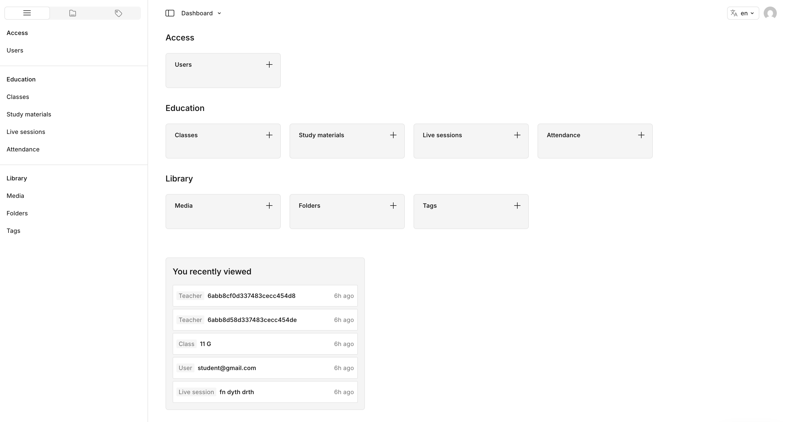

# EMS

Education Management System — classes, live sessions, attendance, and study materials.



**Stack:** Next.js 16 · Payload CMS 4 · MongoDB · LiveKit · Vercel Blob · Capacitor

## Features

- **Classes** — enroll students, assign teachers
- **Live sessions** — LiveKit video classrooms with recordings
- **Attendance** — tracked from LiveKit webhooks
- **Study materials** — media library with folders & tags
- **Mobile** — iOS / Android shell via Capacitor

## Setup

```bash
cp .env.example .env
bun install
bun dev
```

Open [http://localhost:3000](http://localhost:3000) → create the first admin user.

### Env

| Variable | Required | Notes |
|---|---|---|
| `DATABASE_URL` | yes | MongoDB connection string |
| `DB_NAME` | yes | Database name |
| `PAYLOAD_SECRET` | yes | Auth secret |
| `BLOB_READ_WRITE_TOKEN` | yes | Vercel Blob uploads |
| `LIVEKIT_API_KEY` | yes | Live sessions |
| `LIVEKIT_API_SECRET` | yes | Live sessions |
| `LIVEKIT_URL` | yes | e.g. `wss://….livekit.cloud` |
| `CAPACITOR_SERVER_URL` | mobile only | App URL the native shell loads |

After deploy, point the LiveKit webhook to:

```
https://YOUR_DOMAIN/api/livekit/webhook
```

### Docker (optional)

```bash
# set MONGODB_URL=mongodb://127.0.0.1/<dbname> in .env
docker compose up -d
bun install && bun dev
```

## Scripts

| Command | What it does |
|---|---|
| `bun dev` | Dev server |
| `bun build` / `bun start` | Production |
| `bun run generate:types` | Payload types |
| `bun run generate:importmap` | Admin import map |
| `bun test` | Unit + e2e |
| `bun run cap:ios` / `cap:android` | Open native projects |
| `bun run cap:sync` | Sync Capacitor |

## Collections

| Group | Collections |
|---|---|
| Access | Users |
| Education | Classes, ClassTeachers, Enrollments, Materials, Sessions, Attendance, RecordingParts |
| Library | Media, Folders, Tags |

## Mobile

```bash
# CAPACITOR_SERVER_URL in .env → your running web app
bun run cap:sync
bun run cap:ios      # or cap:android
```
